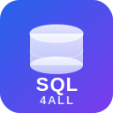
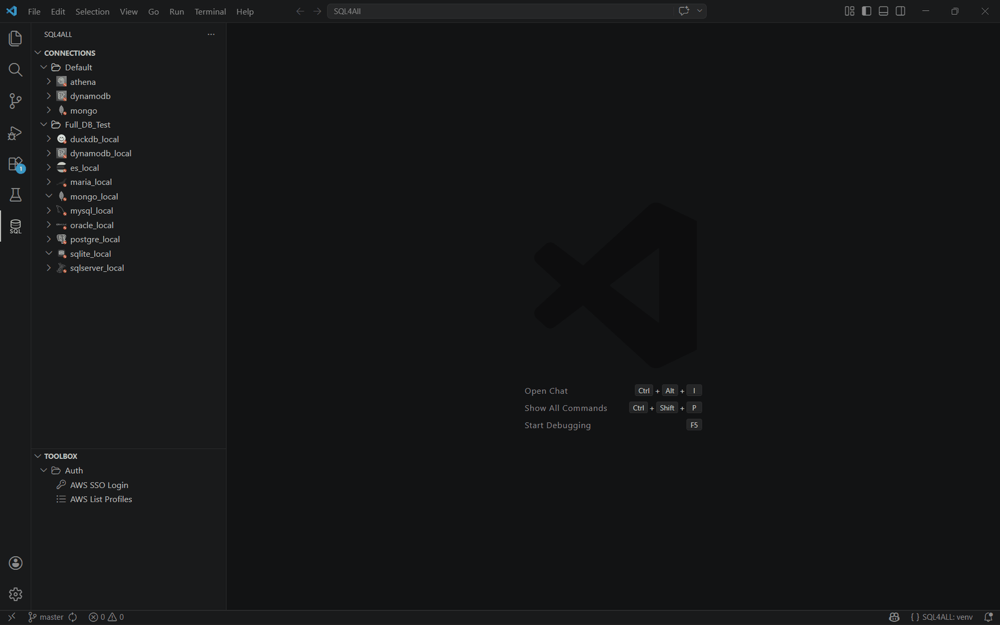

#  SQL4ALL

A powerful VS Code extension for querying SQL and NoSQL databases using standard SQL syntax. Write SQL queries and execute them against various supported database engines — powered by SQLAlchemy.

## Features

- **SQL Query Editor** — A editor with SQL syntax highlighting
- **Connection Manager** — Save, edit, and manage multiple database connections
- **SQL & NoSQL Databases** — PostgreSQL, MySQL, SQLite, MongoDB, Snowflake, BigQuery, and many more
- **Result Viewer** — View query results in an organized table or JSON format
- **Export Results** — Export to CSV or JSON
- **Auto Driver Install** — The required Python driver for each database is installed automatically on first use

## Supported Databases

SQL4ALL supports any database that has a [SQLAlchemy dialect](https://docs.sqlalchemy.org/en/20/dialects/) — including PostgreSQL, MySQL, SQLite, Oracle, SQL Server, MongoDB, Snowflake, BigQuery, DuckDB, and many more.

See the full list of [included](https://docs.sqlalchemy.org/en/20/dialects/) and [external](https://docs.sqlalchemy.org/en/20/dialects/#external-dialects) dialects in the SQLAlchemy documentation.

## Requirements

- VS Code 1.110.0 or higher
- Python 3.9 or higher

### Python Dependencies

The extension automatically installs the required Python packages:

- `sqlalchemy` >= 2.0 — core query engine
- A database-specific driver — installed automatically on first connection

## Installation

1. Open VS Code
2. Go to Extensions (`Ctrl+Shift+X` / `Cmd+Shift+X`)
3. Search for **SQL4ALL**
4. Click Install

## Quick Start

1. **Add a Connection** — Click the **+** button in the SQL4ALL sidebar
2. **Select Database Type** — Pick from the supported list and fill in credentials
3. **Open SQL Executor** — Click the ▶ button on a connection to list its tables and open the editor
4. **Write & Run** — Enter a SQL query, then press `Ctrl+Enter` or click **Run**
5. **View Results** — Results appear in the table below the editor
6. **Export** — Click **Export CSV** or **Export JSON** to save results

## Known Issues

- Very large result sets (>100K rows) may impact performance
- Some databases require additional system-level dependencies (e.g., ODBC drivers for SQL Server)
